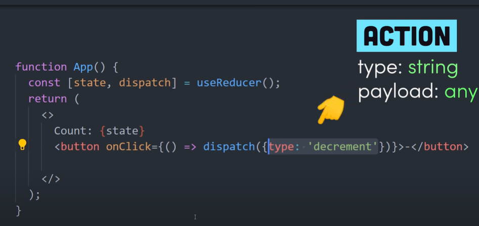

1. how to play with SVG?
2. Using the proper container
3. Using font
4. Logo and text animation

Why use react hooks? 

1. use state without writing a class
2. avoid wrapper hell (nested component)
3. use is the prefix for hooks
4. useState - handle reactive data (state)  

5. use effect is related with lifecycle, function will be called once manipulation happens
6. useReducer (similar to redux) is using a dispatch with an action type and an optional data payload  

1. asd 

